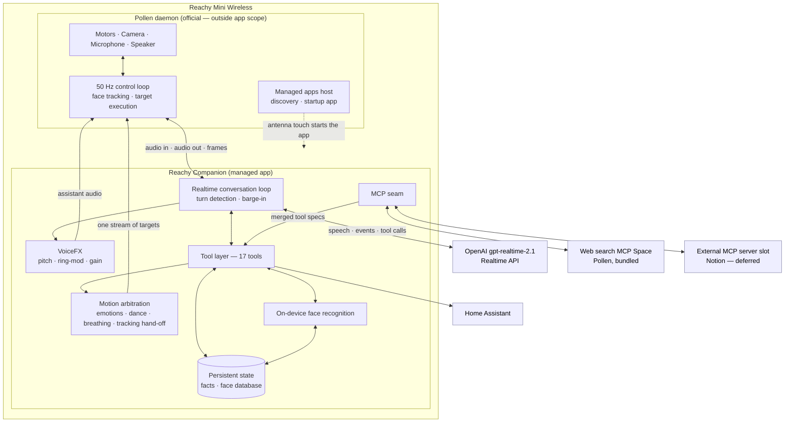

# PRD — Reachy Mini Realtime AI Agent POC

**Product:** Reachy Companion
**Version:** 1.0
**Date:** 2026-08-19
**Status:** POC implemented, live validation pending
**Robot:** Reachy Mini Wireless
**Primary AI model:** `gpt-realtime-2.1`

---

## Table of Contents

| §   | Title                                            |
| --- | ------------------------------------------------ |
| 1   | [Overview & Goals](#1-overview--goals)           |
| 2   | [Mandatory Pre-Development Research](#2-mandatory-pre-development-research) |
| 3   | [Product Experience & Persona](#3-product-experience--persona) |
| 4   | [User Stories](#4-user-stories)                  |
| 5   | [Primary User Journey](#5-primary-user-journey)  |
| 6   | [Extended User Journeys](#6-extended-user-journeys) |
| 7   | [Functional Scope](#7-functional-scope)          |
| 8   | [POC Success Criteria](#8-poc-success-criteria)  |
| 9   | [Non-Goals](#9-non-goals)                        |
| 10  | [Implementation Philosophy](#10-implementation-philosophy) |
| 11  | [Adversarial Review](#11-adversarial-review)     |
| 12  | [System Architecture](#12-system-architecture)   |
| 13  | [Definition of Done](#13-definition-of-done)     |
| A   | [Appendix — Current Status](#appendix-a--current-status-2026-08-19) |

---

## 1. Overview & Goals

### 1.1 Problem statement

A voice assistant answers questions. A robot that only answers questions is a
speaker with a face. Reachy Mini has a camera, motors, antennas and a head that
can look at a person — none of which a conventional assistant loop uses. The gap
is not intelligence; it is presence. Conversation latency, turn handling, gaze
and physical reaction have to be good enough that a person stops adapting their
behaviour to the machine.

This POC exists to answer one question: does putting a fast, interruptible,
tool-using realtime model behind an expressive physical body produce an
interaction that feels categorically different from a smart speaker?

### 1.2 Target user

An individual at home or at a desk who talks to Reachy in Chinese (primary) or
whatever language they open with, expects to be understood at natural speaking
pace, and expects the robot to look at them, react, see what they are holding,
look things up, and act on the house.

A secondary user is the developer extending Reachy: adding one more capability
must not mean touching the conversation engine.

### 1.3 Product goal

Build a custom Reachy Mini application that demonstrates a more capable AI
companion experience while preserving the best parts of the official Reachy
ecosystem.

The POC proves that Reachy can:

1. Hold fast, natural, interruptible voice conversations.
2. Look at and track the person speaking.
3. React with appropriate physical expression and movement.
4. Use its camera to understand what it sees.
5. Search the live web when current information is required.
6. Use external tools and MCP integrations.
7. Gain new Skills, including control of devices in the home.
8. Sound like a character rather than a default synthetic voice.
9. Remember what it is told, and remember who it is talking to.

The goal is **not** to build a generic robotics or agent platform.

### 1.4 Success at a glance

Success is five demonstrations working reliably in front of a person, defined in
§8: Chinese conversation with interruption, physical expression, camera-based
description, automatic web search, and one real home-device action. Everything
else in this document exists to support those five.

---

## 2. Mandatory Pre-Development Research

Before implementing the POC, the developer must first study the current official
Reachy Mini codebase. This is a gate, not a suggestion: no robot-facing code is
written until both studies exist in writing.

### 2.1 Reachy Mini SDK

Repository: `pollen-robotics/reachy_mini`

Understand how the official SDK handles:

- Robot connection
- Camera
- Microphone and speaker
- Face and head tracking
- Motion
- Robot state
- App lifecycle

The official SDK is the foundation and is reused instead of recreating
robot-level functionality.

### 2.2 Reachy Mini Conversation App

Repository: `pollen-robotics/reachy_mini_conversation_app`

Study especially:

- Realtime backend integration
- Audio handling
- Turn handling
- Face tracking
- Camera usage
- Emotion movements
- Speech-reactive movements
- Movement arbitration
- Tool calling

The official app already provides realtime backends, vision, layered motion,
head tracking and asynchronous tools. These implementations are reused or
adapted where practical rather than recreated.

### 2.3 Development principle

Create our own application repository, but treat the official repositories as
reference implementations and dependencies. Do not maintain a heavily modified
long-lived fork unless investigation shows that doing so is clearly simpler.

**Outcome of the research phase:** the official scaffolder produces an app that
is a one-time copy of the conversation app with its own package identity, and
the upstream app is explicitly not designed to be imported as a library. The
project therefore adapts a scaffolded copy in place and keeps read-only clones
of both official repositories for diffing.

---

## 3. Product Experience & Persona

### 3.1 The experience pillar

> Reachy feels like a physically present AI character rather than a voice
> assistant attached to a robot.

Four things have to arrive together for that to land:

**Voice + Vision + Physical reaction + Tools**

Any one of them alone is a familiar product. The combination is the bet.

### 3.2 Reachy's character

Reachy is a small desktop robot companion with a consistent personality, shipped
as a single locked persona rather than a menu of interchangeable characters.

| Trait          | Expression                                                       |
| -------------- | ---------------------------------------------------------------- |
| Cheerful       | Light, upbeat tone; celebrates with the body, not just words     |
| Concise        | Answers like a person sitting across the table, never a lecture  |
| Chinese-first  | Speaks natural, colloquial Chinese by default; follows the user into another language if they switch |
| Honest         | Says it does not know rather than guessing; never guesses a face |
| Cute robotic   | A pitched-up, subtly ring-modulated voice at natural speaking pace, applied whenever the voice filter is enabled in configuration |
| Embodied       | Looks at the speaker, reacts physically, sleeps when asked       |

### 3.3 Voice identity

The realtime model ships a fixed catalogue of voices and no custom-voice option,
and "robotic" is a texture no stock voice produces. Reachy's voice is therefore
built on the robot: the model's chosen voice is pitched up and lightly
ring-modulated on-device, with the duration preserved so the speaking pace stays
natural. The model's own emotional performance survives the treatment — the
effect is a character filter, not a different speaker. The filter is applied
when it is enabled in configuration: the code default is off, and the robot
ships with it switched on.

---

## 4. User Stories

### US-01 — Natural conversation

**As a user,** I want to speak naturally with Reachy, including short pauses and
interruptions, **so that** I do not have to adapt my speaking style to a robot.

Requirements:

- Speech-to-speech conversation on `gpt-realtime-2.1`.
- The user can interrupt Reachy while it is speaking and Reachy stops.
- Reachy does not respond prematurely during a normal mid-sentence pause.
- Chinese conversation is the primary POC scenario.

**How interruption actually works.** The decision is server-side: the session
runs with server voice-activity detection and `interrupt_response` on, so the
model stops generating when it hears the user. The app's own part is local — on
the "user started speaking" event it clears the audio it has queued for the
speaker. It does not send a cancel or a truncate back to the model, so the
model's context can still hold audio the user never heard. The on-screen stop
button is a different path with a known open bug: it clears the local queue
without stopping the response, and playback resumes. Voice barge-in is the path
the demo depends on.

### US-02 — Reachy looks at me

**As a user,** I want Reachy to look toward me while we interact, **so that** the
conversation feels physically engaging.

Requirements:

- Reuse the robot's existing face and head tracking.
- Tracking runs from app start; it does not depend on the AI model issuing
  movement commands.
- One deliberate exception: while Reachy itself is speaking, tracking is
  released — its weight drops to zero and the head holds the pose it had locked
  onto — so emotion and speech-reactive motion own the head for the length of
  the turn. Tracking re-engages at full weight when the turn ends.
- Head movement stays smooth and does not jitter.

### US-03 — Reachy shows emotion

**As a user,** I want Reachy to physically react to what I say, **so that** its
responses feel expressive rather than purely verbal.

Example: the user says "I finally got the job!" — Reachy plays a celebratory
move with head, body and antennas, and responds verbally.

Requirements:

- Use the existing emotion library and speech-reactive motion as the primary
  source of expression before creating anything new.
- Emotion moves do not compete with tracking or breathing; they take over from
  them. Tracking is already released while Reachy speaks, and the emotion plays
  as an offset from the head pose frozen at that moment, so the move stays aimed
  at the person instead of drifting off them. Idle breathing is a primary move
  like any other, so an emotion cancels it, and it restarts about 0.3 s after
  the last movement activity.

### US-04 — Reachy can see

**As a user,** I want to ask Reachy about something in front of it, **so that**
the conversation can include the physical environment.

Example: "What am I holding?"

Requirements:

- Capture a single camera frame on demand.
- Attach the image to the ongoing realtime conversation.
- Answer from what the frame actually shows.
- No continuous video streaming to the cloud.

### US-05 — Reachy can search the web

**As a user,** I want Reachy to search the internet automatically when I ask
about current information, **so that** it is not limited to model knowledge.

Example: "What happened with NVIDIA today?"

Requirements:

- Reachy recognises on its own that fresh information is needed.
- The user never has to say "use web search".
- The answer is spoken back inside the same conversation.

### US-06 — Reachy can use tools

**As a user,** I want Reachy to perform actions, not only answer questions.

Requirements — tool calling demonstrated for at least:

- Camera
- Web search
- Robot expression and motion
- One external service

### US-07 — Reachy can reach an external service

**As a user,** I want Reachy to reach an external service such as Notion, **so
that** it can work with information outside the conversation.

Example: "What is the latest status of my Magic Mirror project in Notion?"

Requirements:

- One working MCP integration is sufficient for the POC.
- A server that is unreachable or unauthorised is skipped, logged, and never
  blocks startup.

**Where this stands.** The MCP mechanism is live, not planned: the bundled web
search tool is itself an MCP server integration — a remote MCP Space discovered
and namespaced at startup — and it has been exercised in a live run with real
results. What is deferred, by operator decision, is the *external personal
service*: Notion is configured but has no credentials, so its tools do not
register.

### US-08 — Reachy can control the home

**As a user,** I want to ask Reachy to control something in the house in natural
language.

Examples: "Turn on the living room lights." / "Turn off the lamp." The Skill
exposes on, off and toggle — nothing that sets a level or a temperature.

Requirements:

- One real Home Control Skill acting on one real device.
- The model may only target devices from an explicit configured allowlist.
- The integration may use Home Assistant, MCP, or another practical API.

### US-09 — New Skills can be added

**As a developer,** I want to add another capability without rewriting the
conversation system, **so that** Reachy's functionality can grow.

Requirements:

- Adding a Skill is one new file plus one line in the persona profile.
- The conversational core is never edited to add a Skill.
- A Skill that already exists as a remote MCP server needs no code at all —
  true today for the one preconfigured server slot, which the MCP module
  hardcodes under the `notion` alias: filling in its URL and token env vars is
  the whole integration. A *second* server is still one new tuple in that
  module's server table plus its two env vars — no change to the conversational
  core, but not literally zero code.
- A simple, understandable extension pattern is enough — no plugin platform.

### US-10 — Reachy has a voice of its own

**As a user,** I want Reachy to sound like a character rather than a default
text-to-speech voice, **so that** it reads as a robot companion and not as an app.

Requirements:

- The voice is pitched up into a cute robotic register.
- Speaking pace is preserved — pitch moves, duration does not.
- A subtle robotic timbre sits on top without making speech hard to understand.
- The whole effect is produced on the robot, adds only a few tens of
  milliseconds, and can be switched off without changing anything else.

### US-11 — Reachy remembers what I tell it

**As a user,** I want Reachy to remember facts I tell it — my name, my
preferences — **so that** I do not have to reintroduce myself every session.

Requirements:

- Reachy records a fact when the user shares something durable about themselves.
- Remembered facts are available in later sessions.
- Memory survives an app update or reinstall — not because the store sits
  somewhere safe, but because the deployment procedure backs it up before the
  install and restores it afterwards. The store lives inside the installed
  package, which a reinstall wipes; the backup/restore step is what makes the
  guarantee true, and it is mandatory for that reason.
- The user can ask Reachy to forget or correct a fact, and it does.

### US-12 — Reachy remembers faces

**As a user,** I want Reachy to learn my face on request and recognise me later,
**so that** it greets me by name instead of treating me as a stranger.

Requirements:

- The user can enrol a face by name in conversation ("remember me, I'm X").
- Reachy answers "who am I?" using what it has enrolled.
- On waking, Reachy takes one look and greets a recognised person by name.
- An unknown or uncertain person is reported as unknown. Reachy never guesses a
  name, and a near-tie between two enrolled people is reported as ambiguous.
- Recognition is not continuous: one check at wake, plus explicit requests.
- The feature can be disabled entirely, and the automatic greeting check can be
  disabled while keeping the conversational tools.

> **Privacy.** Face recognition runs entirely on the robot, and no image is ever
> stored or transmitted. What the cloud model receives is the whole of the tool
> result: a status, a count of faces in the frame, the matched name when there
> is one, a similarity score rounded to three decimals, the runner-up name only
> when the answer is `ambiguous` — where naming the near-tie is the point of the
> answer — and, when something went wrong, a machine-readable reason code drawn
> from a closed set of seven: `face_memory_disabled`, `camera_disabled`,
> `no_frame`, `unsupported_frame`, `model_unavailable`, `invalid_name`,
> `internal_error`. Exception text never travels; it stays in the robot's local
> log. What is stored on the robot for each enrolled person is an id, a name, up
> to three numeric face signatures and two timestamps — created and last
> updated. No image, and no signature, ever leaves the device.

---

## 5. Primary User Journey

### Journey A — Normal conversation

1. Reachy is awake and idle; the head is already tracking faces.
2. The user approaches and starts talking. Reachy's head follows them.
3. The user speaks naturally, including brief mid-sentence pauses. Reachy waits
   through them instead of cutting in.
4. When the turn is genuinely complete, Reachy answers in speech, in the user's
   language.
5. While speaking, Reachy makes subtle speech-reactive movement.
6. Where the content warrants it, Reachy adds an emotional reaction — a
   celebratory move, an antenna flick. Tracking is already released for the
   duration of the turn, and the move plays as an offset from the head pose
   frozen when Reachy began speaking, so it stays aimed at the person.
7. The user interrupts mid-sentence. The server's voice-activity detection stops
   the response and the app drops the audio it had queued, so Reachy falls
   silent and listens. The model's context may still contain the tail the user
   never heard.
8. The conversation continues from the interruption without a restart.

**Success:** the exchange feels fast, and the user never modifies how they speak
to accommodate the robot.

---

## 6. Extended User Journeys

### Journey B — Vision

The user asks: "What am I holding?"

1. Reachy is already looking toward the user.
2. Reachy captures one camera frame.
3. The frame is attached to the running conversation for the model to read.
4. Reachy describes what is actually in the frame, verbally.

### Journey C — Current information

The user asks: "What's the weather tomorrow?" or "What's the latest OpenAI news?"

1. Reachy recognises that model knowledge is not enough.
2. Reachy invokes web search without being told to.
3. Reachy may briefly indicate that it is checking.
4. Reachy answers from the retrieved result.
5. The same conversation continues.

### Journey D — External knowledge

The user asks: "Check my Notion and tell me the current project status."

1. Reachy determines an external tool is required.
2. Reachy calls the configured MCP integration.
3. The result comes back.
4. Reachy summarises it conversationally rather than reading it out.

### Journey E — Home control

The user says: "Turn on the living room lights."

1. Reachy understands the requested action and maps it to a configured device.
2. Reachy calls the Home Control Skill.
3. The device changes state.
4. Reachy confirms verbally, optionally with a small physical reaction.
5. If the named device is not on the allowlist, Reachy says which devices it can
   actually control.

### Journey F — Wake and recognition

1. Reachy sits asleep on the desk: motors relaxed, sleep pose, nothing running.
2. The user touches an antenna.
3. The companion app starts automatically — no laptop, no dashboard, no console.
4. Reachy takes a single look at whoever is in front of the camera.
5. If it recognises them, the opening greeting uses their name. The check is
   deliberately in front of the greeting, so it may hold the greeting back by up
   to its own time budget — 1.2 seconds by default, tunable. On an overrun, a
   failure, or nobody recognised, the greeting goes out unchanged.
6. Conversation proceeds as in Journey A.
7. The user says "去睡觉吧" ("go to sleep").
8. Reachy says a short goodbye, then returns to the sleep pose and releases the
   motors.

**Success:** the entire session, from asleep to asleep, is driven by touching
the robot and talking to it.

---

## 7. Functional Scope

The POC must deliver the following. Requirements are grouped by subsystem.

### 7.1 Conversation

| ID    | Requirement                                                              |
| ----- | ------------------------------------------------------------------------ |
| F-C1  | Speech-to-speech conversation on `gpt-realtime-2.1`                      |
| F-C2  | Turn detection tuned so a natural mid-sentence pause does not end the turn |
| F-C3  | Barge-in: the user's voice interrupts Reachy's speech — decided server-side by voice activity, with the app clearing its own playback queue and sending no cancel or truncate of its own |
| F-C4  | Chinese as the default conversational language, following the user if they switch |
| F-C5  | A single locked persona, authoritative over any other profile setting    |
| F-C6  | A character voice applied on-device: pitch-shifted, duration-preserving, lightly ring-modulated, with an off switch |

### 7.2 Embodiment

| ID    | Requirement                                                              |
| ----- | ------------------------------------------------------------------------ |
| F-E1  | Face tracking active from app start, requiring no model tool call; released to weight zero while Reachy speaks and re-engaged afterwards |
| F-E2  | Speech-reactive movement while Reachy speaks                             |
| F-E3  | Emotion moves from the existing library, selectable by the model         |
| F-E4  | Arbitration between emotion moves, idle breathing and tracking: moves are sequential and exclusive, an emotion cancels breathing, and breathing restarts ~0.3 s after the last movement activity |
| F-E5  | Explicit motion tools — head pose, look sweep, dance, and stop controls  |

### 7.3 Vision

| ID    | Requirement                                                              |
| ----- | ------------------------------------------------------------------------ |
| F-V1  | On-demand single-frame capture, attached to the live conversation        |
| F-V2  | No continuous video sent to the cloud                                    |
| F-V3  | On-device face detection and recognition; recognition frames and face signatures never leave the robot. The camera tool is the separate, explicitly requested path that does upload one frame to the model |

### 7.4 Knowledge and tools

| ID    | Requirement                                                              |
| ----- | ------------------------------------------------------------------------ |
| F-K1  | Function/tool calling exposed to the model                               |
| F-K2  | Web search invoked automatically when current information is needed      |
| F-K3  | One working MCP integration — already met by the bundled web-search MCP Space; the external personal service (Notion) is deferred by operator decision |
| F-K4  | One Home Control Skill, restricted to an explicit device allowlist       |
| F-K5  | A new Skill can be added without editing the conversational core         |
| F-K6  | Tools never crash the app: failures return an error result the model can recover from |
| F-K7  | Long-running tools run in the background with status and cancel controls |

### 7.5 Memory

| ID    | Requirement                                                              |
| ----- | ------------------------------------------------------------------------ |
| F-M1  | Reachy stores durable facts the user tells it, and can forget them on request |
| F-M2  | Stored facts are injected into the model's context each session          |
| F-M3  | Face enrolment by name, recall on request, and one recognition check at wake |
| F-M4  | Unknown and ambiguous outcomes are reported honestly, never guessed      |
| F-M5  | Both stores live on the robot and survive an app reinstall — the stores sit inside the installed package, so the mandatory backup/restore step in the deployment procedure is what carries them across |

### 7.6 Lifecycle

| ID    | Requirement                                                              |
| ----- | ------------------------------------------------------------------------ |
| F-L1  | The app installs as a managed app under the robot's own daemon           |
| F-L2  | An antenna touch on the sleeping robot starts the app                    |
| F-L3  | A spoken request puts Reachy back to sleep, with a goodbye first         |
| F-L4  | Configuration is read from environment settings on the robot; no secrets in source |
| F-L5  | The same application runs unchanged against a simulated daemon on a development machine |

---

## 8. POC Success Criteria

The POC is successful if the following five demonstrations work reliably.

### Demo 1 — Conversation

A user can maintain a natural multi-turn Chinese conversation and interrupt
Reachy while it is speaking.

### Demo 2 — Expression

Reachy produces an appropriate physical reaction during conversation.

### Demo 3 — Vision

The user shows Reachy an object and Reachy correctly describes it.

### Demo 4 — Web

The user asks a question requiring information from today, and Reachy
automatically searches before answering.

### Demo 5 — Skill

The user asks Reachy to control one real device in the home, and the action
succeeds.

---

## 9. Non-Goals

The POC does **not** build:

- A generic agent platform
- A generic plugin marketplace
- A sophisticated Skill SDK
- Multi-model routing
- Cost optimisation
- A long-term memory architecture
- Complex user identity or profile systems
- Continuous video understanding
- Advanced authorisation systems
- A new robot motion engine
- Custom motor control
- Mobile or desktop applications
- Production-scale observability
- Enterprise security architecture

These are considered only after the core experience is proven.

> **Amended 2026-08-18.** "Custom face recognition" was originally on this list.
> It was promoted to a requirement (US-12) on an explicit product request, under
> a strict constraint: reuse the SDK's existing face detector, add exactly one
> model, add no new dependencies, and keep everything on the robot. It is not a
> face-recognition subsystem; it is one look at wake time and two conversational
> tools.

---

## 10. Implementation Philosophy

### 10.1 The reuse-first ladder

For every feature, in this order:

1. Check whether the Reachy Mini SDK already provides it.
2. Check how the official Conversation App implements it.
3. Reuse the existing implementation if it solves the problem.
4. Adapt it only where the POC's requirements genuinely differ.
5. Write new functionality only when nothing above applies.

### 10.2 Never recreate

- Face and head tracking
- Gaze smoothing and jitter control
- Camera access
- Audio input and output
- Robot motion primitives
- Motion layering and arbitration
- Existing emotion animations
- Existing speech-reactive movements
- App lifecycle management

### 10.3 Spend effort here instead

- `gpt-realtime-2.1` integration
- Conversation and turn behaviour
- Voice identity
- Web access
- External tools and MCP
- The Skills pattern
- Home interaction
- Memory and face memory
- Thin glue around official APIs

Reuse is also a maintenance position: the smaller the diff against upstream, the
easier it stays to pull in official fixes.

---

## 11. Adversarial Review

Seven ways this project could plausibly fail, and the standing decision against
each.

### Mistake 1 — Rebuilding the official app

The official Conversation App already solves many robot-specific problems.

**Decision:** inspect and reuse first.

### Mistake 2 — Turning the POC into a platform project

"Skills" can easily consume months of framework design.

**Decision:** implement one Home Skill and one external integration. Generalise
only what is obviously necessary.

### Mistake 3 — Putting every robot movement through the LLM

This adds latency and produces unnatural behaviour.

**Decision:** face tracking and baseline robot behaviour keep running through
existing Reachy capabilities, independent of the model.

### Mistake 4 — Overbuilding MCP

The objective is to prove Reachy can use external capabilities, not to build an
MCP management product.

**Decision:** one reliable MCP integration is enough. No OAuth flows, no server
management UI.

### Mistake 5 — Continuous vision

Streaming camera frames continuously adds complexity and cost without proving
the core concept.

**Decision:** local tracking plus on-demand snapshots. Face recognition is one
check at wake plus explicit requests — never a running loop.

### Mistake 6 — Optimising cost before experience

The first question is whether `gpt-realtime-2.1` creates a meaningfully better
interaction.

**Decision:** establish the best interaction first; optimise model cost later.

### Mistake 7 — Designing the final architecture too early

The official code may already solve problems we would otherwise invent
abstractions for.

**Decision:** architecture decisions come after inspecting the SDK and
Conversation App and completing the first integration spike.

---

## 12. System Architecture

This section describes what was actually built.

### 12.1 The robot

The Reachy Mini Wireless runs Pollen Robotics' own daemon. The daemon owns the
hardware outright: motors, camera, microphone, speaker, the face tracker, and
the 50 Hz control loop that turns motion requests into smooth movement. It also
manages applications — it installs them into a shared application environment,
discovers them, and decides which one starts. What it does not own is the choice
of *what* to move: blending emotion moves, dances, idle breathing and the
tracking hand-off happens in the app, which sends the daemon a single stream of
targets.

Reachy Companion is a guest on the robot. The daemon's official APIs cover
discovery, start/stop and startup-app registration; the install itself is a
wheel copied over SSH and installed into the shared apps environment. The
daemon's own code and configuration are out of bounds — with one recorded
exception, a one-time operator-authorised update of the daemon to the required
version line during bring-up, performed through the robot's own updater.

### 12.2 Reachy Companion

Reachy Companion is a managed application. It is installed into the daemon's
shared application environment, advertises itself so the daemon can discover it,
and is registered as the startup application — which is why touching an antenna
on the sleeping robot brings the whole experience up with no other device
involved.

The app began as a scaffolded copy of the official Conversation App and is
adapted in place. Its audio pipeline, motion arbitration, tool registry and app
lifecycle are upstream code. The genuinely new parts are the realtime backend,
the voice filter, the Skills, the MCP configuration seam, and the two memories.

### 12.3 Runtime components

**Realtime conversation loop.** Connects the robot's microphone and speaker to
`gpt-realtime-2.1` over the Realtime API as a continuous speech-to-speech
session. Turn-taking is decided server-side, tuned so that a natural
mid-sentence pause in Chinese does not end the turn, and so the user's voice can
cut in while Reachy is speaking. Audio is resampled between the robot's rate and
the model's rate in both directions.

**VoiceFX.** A small signal chain sitting on the assistant's audio just before
it reaches the speaker. It shifts pitch upward while preserving duration,
applies a light ring modulation for the robotic timbre, and adds makeup gain. It
runs on the robot and is fully reversible — disabled, the audio path is
unchanged. What it costs, measured on the robot: about 48 ms of added delay
typically and 64 ms at the peak (the peak is a resampler buffering spike the
next chunk drains, not standing lag), and roughly the mid-teens percentage of
one CPU core for as long as the assistant is speaking.

**Tool layer.** Seventeen tools are offered to the model: robot expression and
motion, camera capture, web search, home control, fact memory, face memory,
sleep, and two housekeeping tools for tracking long-running work. Tools run
asynchronously alongside the conversation and are contractually forbidden to
crash the app — a failure returns an error the model can talk about.

**MCP seam.** Remote MCP servers are discovered at startup and their tools
merged into the same registry the model sees, under a namespaced prefix.
Discovery is bounded and non-fatal, per server: an unreachable or unauthorised
server costs only its own tools. This seam is already carrying traffic — the web
search tool is a remote MCP Space reached exactly this way. The other route,
for an HTTP MCP endpoint declared in the environment, has one preconfigured
slot; Notion sits in it and is awaiting credentials.

**Motion arbitration.** Primary moves — emotions, dances, explicit head poses,
idle breathing — are mutually exclusive and run in sequence on the app's own
worker, which is the single writer to the daemon. While Reachy speaks, tracking
is released and the head pose it had locked onto becomes the anchor an emotion
plays against.

**On-device face recognition.** Detection reuses the SDK's own face detector; a
single added recognition model turns a detected face into a numeric signature.
Both run on the robot's CPU. Enrolment is explicit and verbal, recognition
happens at wake time and on request, and no recognition frame is ever stored or
transmitted. The camera tool is a separate path and does send its frame to the
model, on explicit request.

**Persistent state.** Two small stores live on the robot — remembered facts and
the enrolled-face database. Both sit in the application's own directory and are
backed up and restored as a mandatory step of every deployment, so they survive
reinstalls.

### 12.4 Component diagram

### 12.5 Development loop

The same application runs unchanged on a Windows development machine against a
simulated daemon. The simulator provides real kinematics and the local webcam
and microphone, with no physics — enough to exercise conversation, tool calling
and the audio chain end to end without a robot on the desk. Two behaviours
cannot be rehearsed there and require the physical robot: live face tracking of
a real person, and any camera scene that needs a properly selected, lit camera.

### 12.6 Deployment shape

The app is built as a single wheel, copied to the robot over SSH, and installed
into the shared application environment. The daemon's official APIs cover the
rest of the lifecycle: discovery, start and stop, and registering the app as the
one an antenna touch wakes into. Configuration and both persistent stores live
in the installed application's own directory, which a reinstall replaces — so
deployment is a ritual that backs them up first and restores them afterward.

The daemon's own code and configuration stay out of scope, with the single
recorded exception noted in §12.1: a one-time authorised update of the daemon to
the required version line during bring-up, through the robot's own updater.

### 12.7 Accepted behaviours and local surfaces

These are real properties of the build, reviewed and accepted as they are for a
home-network POC (operator ruling, 2026-08-19). They are documented here rather
than fixed, and each would need revisiting before anything resembling a product.

**A local console and control channel on the LAN, unauthenticated.** The app
serves a web console and a JSON-RPC control channel bound to all interfaces on
the robot. Anyone who can reach the robot on the home network can make Reachy
speak a chosen line, interrupt it, mute and unmute the microphone, and change
settings including the persona and the enabled tools. There is no password, no
token and no origin check. Accepted for a POC on a trusted home network; it is
not a surface to expose beyond one.

**Spontaneous idle motion.** After about three minutes with no conversation
activity, and only when the body is otherwise idle, the app picks a movement for
itself and plays it — a dance, an emotion, or a small head turn — without
telling the model and without speaking. The "do nothing" option in that lottery
is not among the enabled tools, so in this build the idle timer always produces
movement, weighted roughly two-fifths dance, two-fifths emotion, one-fifth head
turn. Accepted as personality: a robot that never stirs reads as switched off.

**Auto-sleep.** The app shuts itself down after 24 hours without activity, and
the robot returns to the daemon's sleep state. Configurable, and disabled by
setting it to zero.

**Memory caps.** Facts are capped at 60, oldest dropped past that. Faces are
capped at 12 people with up to 3 signatures each; a new signature for a known
person replaces the oldest of theirs, and a thirteenth person evicts whichever
record was least recently updated. These are deliberate, small, and silent — no
one is told a memory fell off the end.

**An environment escape hatch for tools.** Pointing the app at an external tools
directory and setting the autoload flag makes every tool module found there load
and register, regardless of what the locked profile lists. It is off by default,
and it exists for development; on the robot it is a way to hand the model
capabilities the persona never declared.

---

## 13. Definition of Done

The POC is done when a person can walk up to a sleeping Reachy and naturally:

1. Wake it with an antenna touch and be greeted by name.
2. Talk with it.
3. Pause mid-sentence without being cut off, and interrupt it without waiting.
4. Be visually tracked while they speak.
5. See appropriate physical reactions.
6. Ask what Reachy sees.
7. Ask a question that requires live web information.
8. Ask it to retrieve something from one external service.
9. Ask it to control one real device in the home.
10. Tell it something about themselves and have it remembered next time.
11. Tell it to go to sleep, and watch it say goodbye and settle.

If those experiences work convincingly, the POC has proven the product
direction. Anything beyond that is justified by what the POC teaches, not
designed in advance.

---

## Appendix A — Current status (2026-08-19)

| Capability                                  | Status                                    |
| ------------------------------------------- | ----------------------------------------- |
| Demo 1 — Chinese conversation + interruption | Implemented, dev-verified; awaiting live operator validation |
| Demo 2 — Physical expression                | Implemented, dev-verified; awaiting live operator validation |
| Demo 3 — Camera object description          | Implemented, image path proven end to end; awaiting live operator validation (the development simulator cannot present a usable scene) |
| Demo 4 — Automatic web search               | Implemented, dev-verified with real results; awaiting live operator validation |
| Demo 5 — Real home-device action            | Implemented; awaiting Home Assistant credentials, then live validation |
| US-07 — External service via MCP            | The MCP mechanism is live and proven — the bundled web-search tool is itself an MCP server integration, exercised in a live run. The external personal service (Notion) is deferred by operator decision; its slot is configured and awaiting credentials |
| US-10 — Cute robotic voice                  | Implemented and verified on the robot; awaiting an operator listening pass |
| US-11 — Fact memory                         | Implemented and deployed to the robot; awaiting live operator validation |
| US-12 — Face memory                         | Implemented and deployed to the robot; awaiting live operator validation, which is also the only source of recognition-threshold calibration |
| Audit fixes (commit `a5f682d`)              | Six defects found by the 2026-08-19 PRD-vs-code audit are fixed and unit-covered: the background-tool wedge guard at both call sites, per-server MCP discovery isolation, the `move_head` body-yaw arguments, the closed face-tool reason-code contract, dead package data, and a dead environment key. The `move_head` fix is the one still pending confirmation on the robot |

**Deployment state.** The robot is still running the build from before the audit
fixes; the fixes ship with the next deployment.

**Standing risk.** Every remaining item needs a human in front of the robot. The
recognition threshold in particular cannot be calibrated without two real people
in a live session; until then it is set conservatively, which biases the system
toward reporting "unknown" rather than naming the wrong person.
